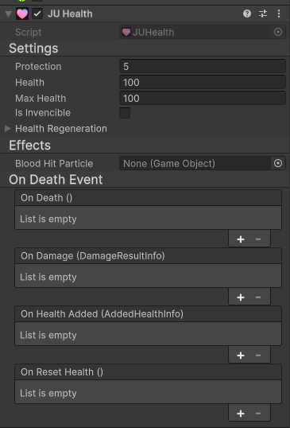

Health System
=============

.. contents::
   :local:
   :depth: 3

JU provides a shared health system composed of two main elements: ``IHealth`` and ``JUHealth``.

``IHealth`` defines how any system should interact with health. It represents a common and safe way
to read, modify, and react to health values, without depending on a specific health implementation.

``JUHealth`` is the default health system provided by JU. It is a implementation of
``IHealth`` and exists to cover common health management needs.

.. warning::

    Custom health systems should **not** be based on ``JUHealth``.
    Instead, they should implement ``IHealth`` directly.

    This ensures that different health systems can coexist and remain compatible
    with all systems that rely on JU.

.. note::
    Any system that needs to interact with health should always communicate through ``IHealth``.
    Direct dependency on ``JUHealth`` should be avoided to keep systems decoupled and interchangeable.

JUHealth Basics
---------------

``JUHealth`` is the default health component provided by JU. It represents a traditional health system,
commonly used by characters, enemies, and any object that can receive damage.

It is responsible for controlling the current health value, the maximum health, and determining
whether the object is alive or dead.

Health and Max Health
~~~~~~~~~~~~~~~~~~~~~

JUHealth works with two core values:

- **Health**: the current life amount of the object
- **Max Health**: the maximum life the object can have

Health values are always kept within valid limits, never going below zero or above the maximum.
JUHealth also exposes a normalized health value (from 0 to 1), which is useful for health bars and UI elements, try ``IHealth.NormalizedHealth``.

Invincibility
~~~~~~~~~~~~~

JUHealth supports an **invincibility** state.

When invincibility is enabled, the object still receives damage requests, but no real damage is applied
to its health. This is commonly used for temporary immunity, cutscenes, special abilities, or
grace periods after being hit.

Health Regeneration
~~~~~~~~~~~~~~~~~~~

JUHealth includes an optional **health regeneration** system.

Health regeneration works automatically based on two values:

- A **delay**, which defines how long after the last hit regeneration starts
- A **speed**, which defines how fast health is restored over time

Regeneration only occurs when the object is alive and stops when health reaches the maximum value
or when new damage is received.

Death and Health Reset
~~~~~~~~~~~~~~~~~~~~~~

When health reaches zero, the object is considered dead.

In this state:
- Health regeneration stops
- Death-related events are triggered

JUHealth also allows health to be fully reset, restoring the object to its maximum health and
bringing it back to a living state. This is typically used for respawning or restarting gameplay scenarios.
For this, try call ``IHealth.ResetHealth()``.

Events
~~~~~~

JUHealth exposes several events that allow other systems to react to health changes without directly
controlling the health system.

- **On Damaged**  
  Triggered whenever damage is applied. Useful for hit reactions, visual effects, sounds, and UI feedback.

- **On Death**  
  Triggered when health reaches zero. Commonly used for death logic, animations, or game state changes.

- **On Health Added**  
  Triggered when health is restored. Useful for healing effects and feedback.

- **On Reset Health**  
  Triggered when health is fully reset. Useful for respawn logic and state cleanup.

Using these events allows systems to stay decoupled, reacting to health changes without relying on
a specific health implementation.

How To...
---------

This section provides practical examples of how to interact with JU health systems
using ``IHealth``. All health-related interactions should always go through this interface.

Getting the Health System
~~~~~~~~~~~~~~~~~~~~~~~~~

Any object that supports health exposes it through ``IHealth``.
Always retrieve the health system using ``GetComponent<IHealth>()``.

.. code-block:: csharp

   IHealth health = GetComponent<IHealth>();

This works for ``JUHealth`` and for any custom health system that implements ``IHealth``.

Applying Damage
~~~~~~~~~~~~~~~

To apply damage, call ``DoDamage``.

Simple damage:

.. code-block:: csharp

   health.DoDamage(25f);

Damage with hit information:

.. code-block:: csharp

   IHealth.DamageInfo damageInfo = new IHealth.DamageInfo
   {
       Damage = 25f,
       HitPosition = hit.point,
       HitDirection = -hit.normal,
       HitOriginPosition = transform.position,
       DamageOwner = gameObject
   };

   health.DoDamage(damageInfo);

The returned result contains information such as the real damage applied
and whether the target was killed.

Damage Parameters Explained
...........................

When applying damage using ``DamageInfo``, additional context can be provided to describe
how and where the damage occurred. These values are optional, but recommended when damage
comes from weapons, projectiles, or physics interactions.

**Damage**
   The amount of damage that should be applied to the health system.
   This is the intended damage value before any modification or blocking.

**DamageOwner**
   The object responsible for the damage.
   Usually the attacker or character that caused the damage.

   This is commonly used by AI, score systems, or hit reactions to identify who caused the damage.

**HitPosition**
   The world position where the damage occurred.

   Used for hit effects, particles, decals, or impact reactions.

**HitDirection**
   The direction from which the damage came.
   Usually points from the attacker toward the damaged object.

   This value is commonly used for knockback, hit reactions, or directional animations.

**HitOriginPosition**
   The original position where the damage started.
   For example, the weapon muzzle, the attacker position, or the projectile spawn point.

   This is useful when the hit position is far from the attacker and additional context is needed.

Optional fields can be left unset when the extra context is not required.
Systems that rely on this data should always validate it before use.

Adding Health
~~~~~~~~~~~~~

To restore health, use ``AddHealth``.

.. code-block:: csharp

   health.AddHealth(new IHealth.AddedHealthInfo
   {
       HealthAdded = 20f,
       Source = gameObject
   });

**HealthAdded** defines how much health will be restored.  
The value is automatically clamped and will never exceed the maximum health.

**Source** represents the object that is providing the health.

This can be:
- A player or character
- A healing item
- A skill, ability, or buff
- Any object responsible for the healing action

The source is optional, but strongly recommended when the healing comes from
another system. It allows other systems (UI, effects, logs, analytics, gameplay
rules) to know **who caused the healing**.

If the source is not relevant, it can be left unset or ``null``.

Temporary Invincibility
~~~~~~~~~~~~~~~~~~~~~~~~

Invincibility can be toggled using ``IsInvencible``.

Example: make the player invincible for a short duration.

.. code-block:: csharp

   IEnumerator TemporaryInvincibility(IHealth health, float duration)
   {
       health.IsInvencible = true;
       yield return new WaitForSeconds(duration);
       health.IsInvencible = false;
   }

Usage:

.. code-block:: csharp

   StartCoroutine(TemporaryInvincibility(health, 3f));

While invincible, all incoming damage is ignored.

.. warning::

   Always interact with health systems through ``IHealth``.
   Do not depend directly on ``JUHealth`` when dealing damage,
   healing, or checking health state.

   This guarantees compatibility with custom health systems and
   keeps systems decoupled and reusable.

Damage Score
~~~~~~~~~~~~

In some scenarios, it is useful to react whenever **any health system** in the game takes damage.
For example: score systems, analytics, combat logs, or global effects.

JU provides a global event called ``IHealth.OnAnyDamaged`` for this purpose.

.. warning::

   ``OnAnyDamaged`` is **only available on Unity version 6000.3 or newer**.

   Attempting to use this feature on older Unity versions will result in
   compilation errors.

This event is triggered whenever **any object implementing ``IHealth``**
receives damage.

Example: logging score when an enemy is damaged by the player.

.. code-block:: csharp

   using JU;
   using JUTPS;
   using UnityEngine;

   public class TestScore : MonoBehaviour
   {
       private static bool _editorSetupDone;

       public static int Score { get; private set; }

       private void Start()
       {
           IHealth.OnAnyDamaged += OnDamaged;

   #if UNITY_EDITOR
           if (!_editorSetupDone)
           {
               _editorSetupDone = true;
               UnityEditor.EditorApplication.playModeStateChanged += mode =>
               {
                   if (mode == UnityEditor.PlayModeStateChange.ExitingPlayMode)
                       Score = 0;
               };
           }
   #endif
       }

       private void OnDestroy()
       {
           IHealth.OnAnyDamaged -= OnDamaged;
       }

       // Called when any IHealth receives damage.
       private void OnDamaged(IHealth.DamageResultInfo damageInfo)
       {
           int score = (int)damageInfo.RealDamage;

           if (damageInfo.DamagedObject is MonoBehaviour healthComponent)
           {
               GameObject playerGameObject = JUGameManager.PlayerController.gameObject;

               // Target was already dead, ignore.
               if (damageInfo.DamagedObject.IsDead && !damageInfo.WasKilled)
                   return;

               // Player took damage, no score.
               if (playerGameObject == healthComponent.gameObject)
                   return;

               // Only enemies generate score.
               if (!healthComponent.gameObject.CompareTag("Enemy"))
                   return;

               // Damage was not caused by the player.
               if (damageInfo.DamageOwner != playerGameObject)
                   return;
           }

           // Bonus score if the target was killed.
           if (damageInfo.WasKilled)
               score *= 2;

           Score += score;
           Debug.Log($"Score: +{score} ---- Total: {Score}");
       }
   }

This approach allows score systems to remain completely decoupled from
specific enemy or health implementations.

Armor/Shield powerups
~~~~~~~~~~~~~~~~~~~~~

JU allows damage to be modified **before it is applied** using
``SubscribeOnBeforeDamaged``.

This is commonly used for armor, buffs, debuffs, or temporary effects.

The callback receives a ``DamageInfo`` structure and must return the modified
damage information.

Example: reduce all incoming damage using a simple multiplier.

.. code-block:: csharp

   using JU;
   using UnityEngine;

   public class SimpleArmor : MonoBehaviour
   {
       [Range(0f, 1f)]
       [SerializeField] private float damageMultiplier = 0.5f;

       private IHealth _health;

       private void Awake()
       {
           _health = GetComponent<IHealth>();
       }

       private void OnEnable()
       {
           _health.SubscribeOnBeforeDamaged(OnBeforeDamaged);
       }

       private void OnDisable()
       {
           _health.UnsubscribeOnBeforeDamaged(OnBeforeDamaged);
       }

       private IHealth.DamageInfo OnBeforeDamaged(IHealth.DamageInfo damageInfo)
       {
           damageInfo.Damage *= damageMultiplier;
           return damageInfo;
       }
   }

While this component is enabled, all incoming damage is multiplied by the
configured value.

For example:
- ``0.5`` → 50% damage reduction
- ``1.0`` → no reduction
- ``0.0`` → damage completely blocked

.. note::

   This logic runs **before** the health system applies damage,
   allowing systems to alter damage without depending on a specific
   health implementation.