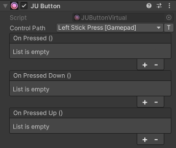

Button
======

``JUButtonVirtual`` is a UI button that sends a value to a Unity Input System
button control when it is pressed overriding the current input value.

Events
------

``OnPressed``
	Invoked while the button is pressed. It is also invoked when the button is
	first pressed.

``OnPressedDown``
	Invoked once when the button is pressed.

``OnPressedUp``
	Invoked when the button is released.

Properties
----------

``IsPressed``
	``true`` while the button is pressed.

``IsPressedDown``
	``true`` for one frame when the button is pressed.

``IsPressedUp``
	``true`` for one frame when the button is released.

