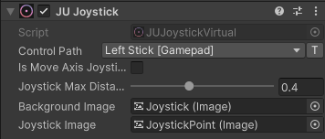

Joystick
========

``JUJoystickVirtual`` simulates a mobile joystick and sends its input to a
Unity Input System Vector2 control.

Fields
------

``JoystickMaxDistance``
	The maximum normalized distance the joystick can move from its center. 

``BackgroundImage``
	The UI image used as the joystick background.

``JoystickImage``
	The UI image used as the draggable joystick center.

Properties
----------

``IsPressed``
	``true`` while the joystick is being pressed.

``InputVector``
	The normalized direction and amount of the joystick input. It is
	``Vector2.zero`` when the joystick is released.

``DragDistanceNormalized``
	The normalized joystick drag distance, from ``0`` to ``1``.
