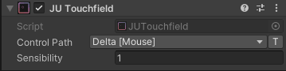

Touchfield
==========

``JUTouchfield`` simulates a mobile touchfield and sends drag input to a Unity
Input System Vector2 control.

Fields
------

``Sensibility``
	Controls the sensitivity applied to the touchfield drag distance.

Properties
----------

``DragDelta``
	The drag distance calculated during the current frame. It is ``Vector2.zero``
	when the touchfield is not pressed.

``IsPressed``
	``true`` while the touchfield is being pressed.
