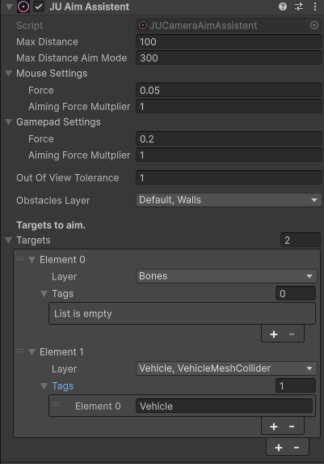
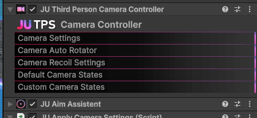
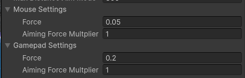
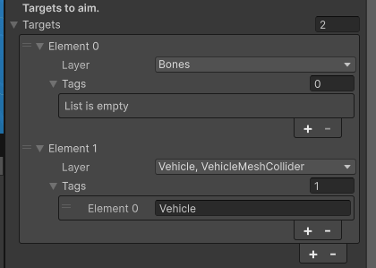

Aim Assist
==========

.. image:: images/aim_assist.gif

Overview
--------

The JUTPS Aim Assist system provides automatic camera assistance to help players
focus targets more easily during aiming or firing.

It works by detecting colliders in front of the camera and smoothly rotating
the camera toward the **center of the detected collider**.

The system can be used with:
- Mouse and keyboard
- Gamepad
- Third-person or first-person cameras

Aim assist can target **any object with a collider**, as long as it matches the
configured layers and optional tags.

Component
---------

The aim assist system is implemented by the ``JUCameraAimAssistent`` component.
It must be attached to the same GameObject as ``TPSCameraController``.

Once added, the system works automatically based on the camera state
(Aiming or Fire mode).

How It Works
------------

Each frame, the aim assist:

1. Casts a ray from the camera forward
2. Searches for valid targets based on the configured target list
3. Selects a target collider
4. Smoothly rotates the camera toward the **center of the collider**
5. Preserves or releases the target based on distance, visibility, and tolerance rules

The rotation force adapts dynamically based on:
- Distance to the target
- Angle between camera forward and target
- Input device (mouse or gamepad)
- Whether the player is actively aiming

Configuration Options
---------------------

Distances
~~~~~~~~~

**Max Distance**
   Maximum distance at which targets can be detected in normal fire mode.

**Max Distance Aim Mode**
   Maximum distance when the player is actively aiming.
   This allows longer-range aim assist when precision is expected
   (for example, sniper or ADS modes).

Input Force Settings
~~~~~~~~~~~~~~~~~~~~

Aim assist force is configured separately for mouse and gamepad.

**Force**
   Base strength of the aim assist rotation.

**Aiming Force Multiplier**
   Additional multiplier applied when the camera is in aiming mode.

This allows:
- Subtle assistance for mouse users
- Stronger assistance for gamepad users
- Extra precision while aiming

Targets Configuration
~~~~~~~~~~~~~~~~~~~~~

Targets are defined using a **priority list**.

Each target entry contains:

**Layer**
   The physics layer used to detect valid colliders.

**Tags (optional)**
   A list of tags used to further filter targets.
   If empty, all objects on the layer are accepted.

Target Priority
~~~~~~~~~~~~~~~

.. image:: images/aim_assist_targets_priority.gif

Targets are processed **in order**.

If multiple objects are in front of the camera:
- The system checks the first target entry
- If a valid collider is found, it is selected
- Lower-priority targets are ignored

This makes it possible to prioritize targets, for example:
- Humanoid enemies first
- Vehicles second
- Environment objects last

This approach ensures consistent and predictable aim behavior.

Obstacle Detection
~~~~~~~~~~~~~~~~~~

Aim assist automatically checks for obstacles between the camera and the target.

If an obstacle is detected:
- The target is considered not visible
- Tolerance rules decide whether the target is preserved or released

Obstacle detection prevents aiming through walls or large objects.

Out of View Tolerance
~~~~~~~~~~~~~~~~~~~~~

.. image:: images/aim_assist_tolerance.gif

**Out Of View Tolerance**
   Defines how long the system will keep following a target
   after it leaves the camera view or becomes temporarily obstructed.

This is especially useful when:
- Targets move quickly
- Small obstacles briefly block the view
- The camera shakes or the player moves rapidly

Instead of instantly losing focus, the system waits for the tolerance time
before releasing the target.

Preserving the Current Target
~~~~~~~~~~~~~~~~~~~~~~~~~~~~~

The aim assist preserves the **current target** even if another object briefly
enters the camera ray.

This prevents unstable behavior such as:
- Rapid target switching
- Flickering aim
- Losing focus during close combat

The target will only change if:
- The new object remains in focus long enough
- The current target moves out of range
- The current target becomes invalid

Camera States
~~~~~~~~~~~~~

Aim assist only works when the camera is in specific states:

- **Fire Mode**
- **Aiming Mode**

If the camera is in any other state, aim assist is disabled automatically.

This ensures the system does not interfere with:
- Free look
- Cinematics
- Non-combat camera modes
