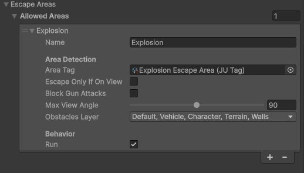
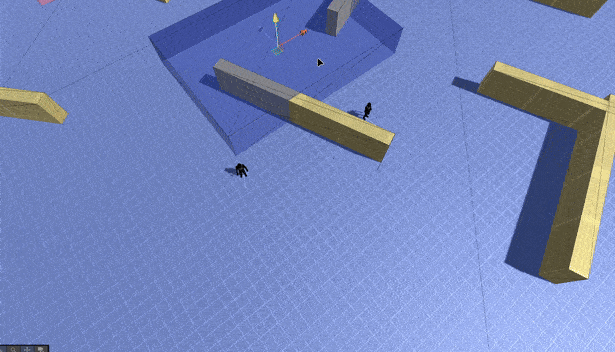

Escape Action
=============

Overview
--------

The **Escape** action allows an AI to **avoid dangerous areas** such as explosions, grenades, or any other zone that should not be entered.

When the AI detects that it is inside (or about to enter) an escape area, this action temporarily overrides movement and drives the character **away from the danger**.

This action is commonly used alongside combat or patrol behaviors to add survival instincts to humanoid AIs.

How It Works
------------

At a high level, the Escape action:

- Detects if the AI is inside a registered escape area
- Calculates a safe direction away from the area
- Moves the AI out of the danger zone
- Optionally forces running while escaping
- Optionally blocks gun attacks during escape

Once the AI leaves the escape area, control is returned to the main AI logic.

Escape Areas
------------

Escape areas represent zones that the AI should avoid.

They are usually created using a dedicated component and can represent:

- Explosion zones
- Grenade blast radius
- Temporary danger zones
- Environmental hazards

Each escape area is identified using a **tag**, allowing different AIs to react only to relevant dangers.

Some areas can be configured so the AI will **only escape if the area is visible**, which is useful for scenarios like grenades — an AI will not flee from a grenade it cannot see.

Escape Area Configuration
-------------------------

Each escape area can define the following behavior:

- **Escape Only If On View**  
  The AI escapes only if the area is within its field of view.

- **Run**  
  Forces the AI to run while escaping.

- **Block Gun Attacks**  
  Prevents the AI from firing weapons while escaping.

- **View Angle & Obstacles**  
  Used to determine whether the area is considered visible to the AI.

These options allow escape behavior to feel reactive and believable instead of purely mechanical.

Using Escape in a Custom AI
---------------------------

Below is a simple example showing how to integrate the Escape action into a custom AI controller.

The Escape action is updated every frame and can override movement when the AI is inside a danger area.

.. code-block:: csharp

    using JU.CharacterSystem.AI.EscapeSystem;
    using UnityEngine;

    namespace JU.CharacterSystem.AI.Examples
    {
        /// 

        /// Example of Escape AI action usage.
        /// 

        [AddComponentMenu("JU TPS/AI/Examples/JU AI Escape Action Example")]
        public class JU_AI_EscapeActionExample : JUCharacterAIBase
        {
            /// 

            /// The escape action instance.
            /// 

            public Escape Escape;

            protected override void Reset()
            {
                base.Reset();
                Escape.Reset();
            }

            protected override void OnValidate()
            {
                base.OnValidate();
                Escape.OnValidate();
            }

            protected override void Awake()
            {
                base.Awake();
                Escape.Setup(this);
            }

            protected override void OnDestroy()
            {
                base.OnDestroy();
                Escape.Unsetup();
            }

            protected override void Update()
            {
                base.Update();

                var control = new AIControlData();

                // Try escape from danger areas if have.
                Escape.Update(ref control);

                Control = control;
            }

            protected override void OnDrawGizmos()
            {
                base.OnDrawGizmos();
                Escape.DrawGizmos();
            }

            protected override void OnDrawGizmosSelected()
            {
                base.OnDrawGizmosSelected();
                Escape.DrawGizmosSelected();
            }
        }
    }

Notes
-----

- The Escape action does not replace the AI main logic; it temporarily overrides movement when needed.
- Multiple escape areas can overlap and are handled automatically.
