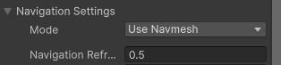

AI Actions
==========

Overview
--------

An **AI Action** is a modular behavior block responsible for **modifying the AI control data** in order to perform a specific action, such as moving, attacking, escaping, or searching.

Actions do not make decisions by themselves.
They only **receive the current control state**, apply their logic, and **output updated control data** that drives the humanoid character.

This design allows actions to be reused, combined to create different type of AIs, like NPCs, soldies, enemies etc.

How an Action Works
******************

An AI Action follows this flow:

1. Receives the current AI control data
2. Evaluates its own logic (movement, attack, escape, etc.)
3. Modifies the control data if necessary
4. Returns the updated control data to the AI controller

The AI controller decides **which action runs and when**, while the action focuses only on *how* to perform a behavior.

Simple Pseudo Code
******************

Below is a simplified pseudo-code example of how an AI Action works internally.

This example represents an action that moves the AI toward a point.

.. code-block:: text

    function UpdateAction(destination, controlData):

        // Calculate direction to destination
        direction = normalize(destination - AI.position)

        // Stop if close enough
        if distance(AI.position, destination) < stopDistance:
            direction = Vector3.zero

        // Decide if should run
        controlData.isRunning = distance(AI.position, destination) > runDistance

        // Apply movement and look direction
        controlData.moveDirection = direction
        controlData.lookDirection = direction

        return controlData

The action does not move the character directly.
It only **describes what the character should do**, using the control data.

Control Data Responsibility
******************

AI Actions operate by modifying a shared **control data structure**, which may include:

- Movement direction
- Look direction
- Running or walking state
- Attack state
- Pose or stance flags

The humanoid character controller reads this data every frame and applies it consistently.

Navigation Support
******************

Actions can work **with or without NavMesh**:

- **With NavMesh**  
  The action calculates paths and follows waypoints, avoiding obstacles.

- **Without NavMesh**  
  The action moves directly toward the target direction.
  In this mode, the AI does **not avoid obstacles**.

This allows the same action to be used in both simple and advanced navigation setups.

Available Actions
-----------------

Each action is documented separately.

.. toctree::
    :maxdepth: 1

    escape/escape_action
