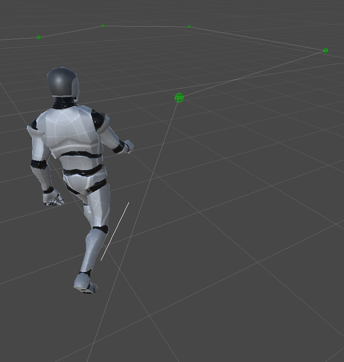
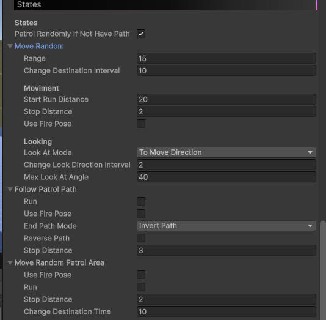
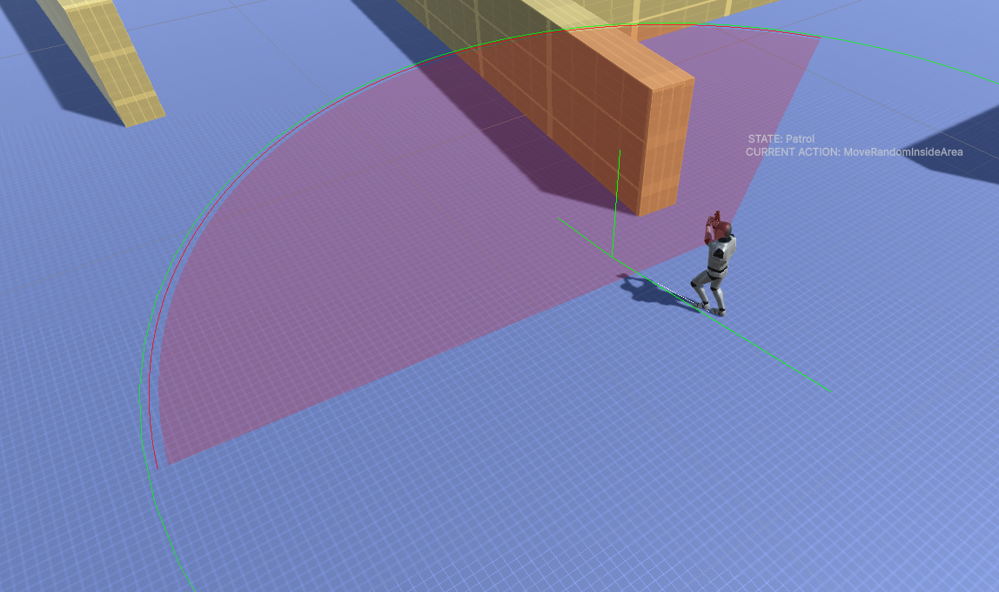
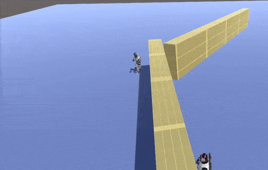

Patrol AI
=========

.. image:: images/patrol_ai.gif

Overview
--------

The Patrol AI is a **generic patrol AI** designed for common NPC behaviors such as guards, soldiers, and patrolling enemies.
Its main responsibility is to patrol an area, react to stimuli, engage targets when detected, and return to patrol when the situation is resolved.

State Summary
-------------

The Patrol AI cycles between the following behaviors:

- Patrolling
- Moving to a suspicious position
- Searching for a lost target
- Attacking a visible target
- Escaping dangerous areas

Patrol Behavior
---------------

The AI can patrol in different ways:

- Follow a predefined waypoint path
- Patrol randomly inside a defined area
- Move randomly around its spawn position if no path or area is defined

Vision and Combat
-----------------

The Patrol AI uses a :doc:`Field Of View sensor <../../sensors/field_of_view/field_of_view_sensor>` to detect targets.

- If a valid target enters the field of view, the AI will engage and attack it
- While attacking, the AI keeps tracking the target visually
- If the target is lost, the AI will try to relocate it before giving up

Hearing and Investigation
-------------------------

.. image:: images/patrol_investigation.gif
    :scale: 70%

The AI can **hear sounds** using :doc:`Hear sensor <../sensors/hear/hear_sensor>` such as gunshots, explosions, footsteps, or other noise events.

When a sound is detected:

- The AI moves to the sound position
- It searches the area for a possible target
- Depending on its configuration, it may attack immediately or search first

Target Loss and Search
----------------------

If the AI loses visual contact with a target:

- It remembers the last known target position
- Moves to that position
- Searches the surrounding area for a limited time

If the target is not found within this time, the AI **returns to patrol mode**.

Explosion and Danger Avoidance
------------------------------

.. image:: images/patrol_escape.gif
    :scale: 70%

The Patrol AI can detect dangerous areas such as explosions or grenades and will attempt to **escape from them** when necessary.

This behavior is handled by a dedicated escape system, documented separately:
:doc:`Escape System <../actions/escape_action>`