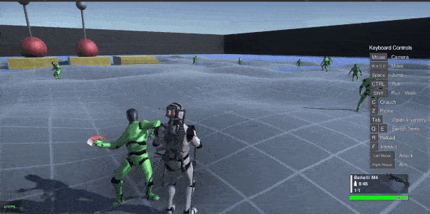
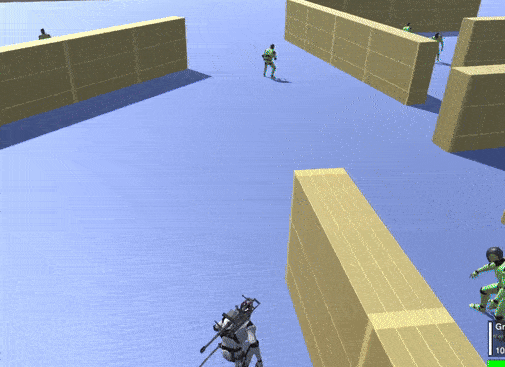

Zombie AI
=========

Overview
--------

The Zombie AI is a **melee-focused enemy AI**, designed for slow and aggressive characters such as zombies or creatures that hunt targets at close range.

Its behavior is simple:
the zombie patrols an area, detects targets using vision and hearing, chases them, and attacks until the target is lost or eliminated.

The Zombie AI does not use ranged combat or advanced tactics.

State Summary
-------------

The Zombie AI cycles between the following behaviors:

- Patrolling
- Attacking a visible target
- Moving to the last known target position
- Searching for a lost target

Patrol Behavior
---------------

The zombie can patrol in different ways depending on its configuration:

- Follow a predefined waypoint path
- Move randomly inside a defined area
- Move randomly around its spawn position if no path or area is defined

Vision and Target Detection
---------------------------

The Zombie AI uses a :doc:`Field Of View sensor <../../sensors/field_of_view/field_of_view_sensor>` to visually detect targets.

Hearing and Investigation
-------------------------

The Zombie AI can detect sounds using the :doc:`Hear sensor <../../sensors/hear/hear_sensor>`.

Sounds may come from:

- Footsteps
- Gunshots
- Explosions
- Other sound source events

When a sound is detected:

- The zombie stores the sound position
- It moves toward the sound source
- If a target becomes visible, it switches to attack mode

If the zombie is already attacking, hearing events are ignored.

Target Loss and Search
----------------------

If the zombie loses visual contact with its target:

1. It moves to the last known target position
2. Once it reaches the area, it starts searching nearby
3. The zombie searches for a limited amount of time

If the target is not found within this time, the zombie **returns to patrol mode**.

This creates a predictable but tense behavior, ideal for horror gameplay.
