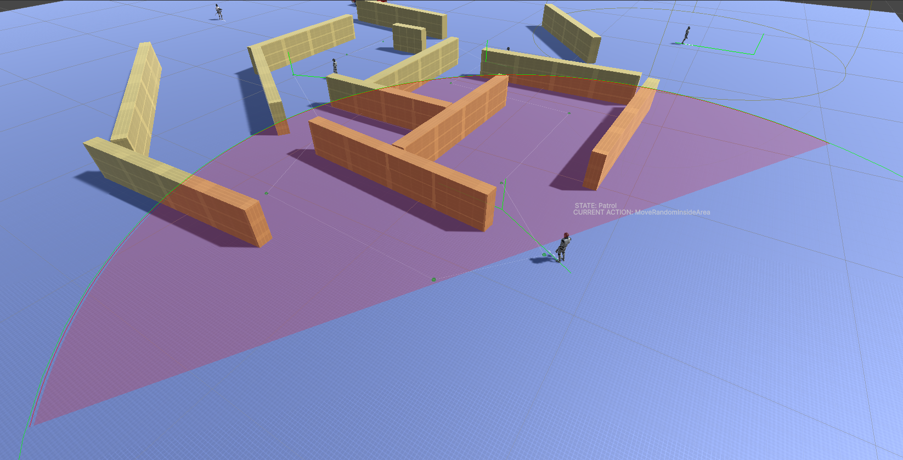
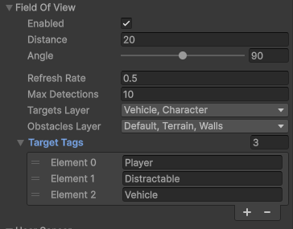

Field of View Sensor
===================

Overview
--------

The **Field of View Sensor** allows an AI to detect objects (colliders only) in the scene.
The sensor simulates a **vision cone**, defined by distance, angle, and line-of-sight checks.

The system works with or without a head or pivot transform.
If a pivot is provided (for example, a character head), it is used as the vision origin and direction.

Main Properties
---------------

**Enabled**
    Enables or disables the field of view sensor.

**Distance**
    Maximum distance at which objects can be detected.

**Angle**
    Maximum vision angle.
    Objects outside this angle are not considered visible.

**RefreshRate**
    How often the sensor scans the environment.
    Higher values improve performance but reduce reaction speed.

**MaxDetections**
    Maximum number of objects evaluated per scan.
    Lower values are ideal when searching for a single target (like the player).

**TargetsLayer**
    Defines which layers can be detected by the sensor.

**TargetTags**
    Optional tag filter to restrict which objects are considered valid targets.

**ObstaclesLayer**
    Layers used for line-of-sight checks.
    Objects behind obstacles are ignored.

Notes
-----

* The sensor does **not** use cameras or rendering
* Detect only colliders.
* Objects must be on the correct layer (and tag, if used) to be detected
