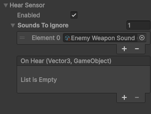
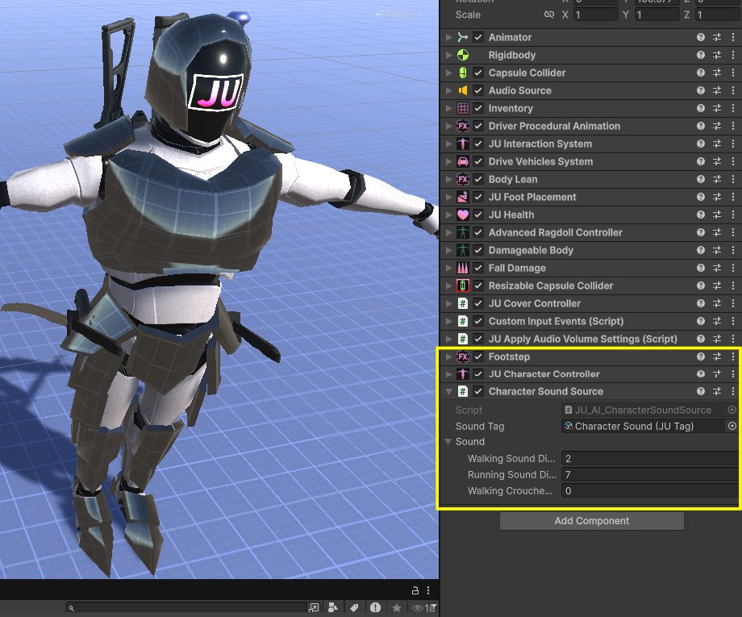
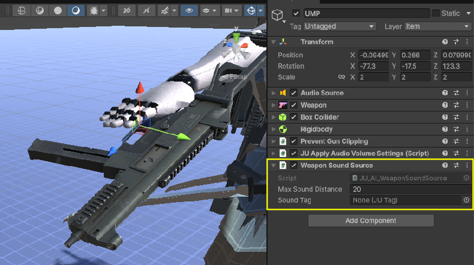
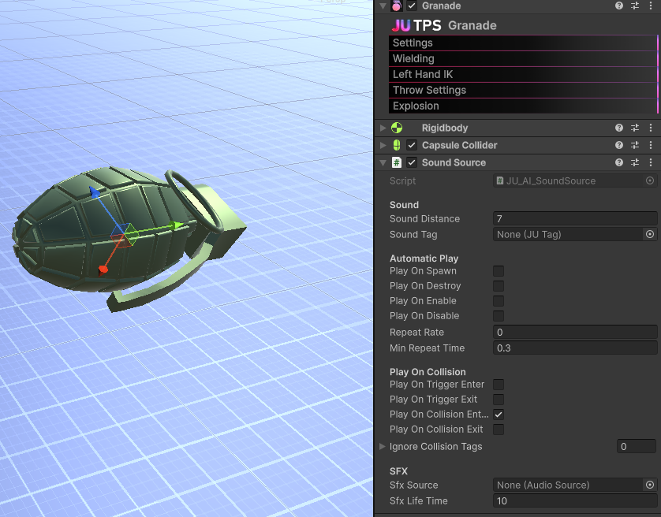

Hear Sensor
===========

Overview
--------

The **Hear Sensor** allows an AI to detect **sound events in the environment**.

It does not control AI behavior.
Instead, it provides information about **where a sound happened** and **who caused it**, allowing the AI logic to decide how to react.

A **sound source** in this system is **not** a Unity ``AudioSource``.

It represents a **sound trigger** that defines the **area where the sound can be detected**.
Audio playback is optional and completely independent from the hearing system.

Sound source components must be added to characters, weapons, or objects in the scene to have detectable sound events.

How Hearing Works
-----------------

At a high level, the hearing system works as follows:

1. A sound source component emits a **sound trigger**
2. The Hear Sensor checks if the trigger is within detection range
3. If detected, the sensor reports the sound data to the AI
4. The AI decides how to react

Character Movement Sounds
-------------------------

To emit sounds from character movement, the character **must have** the
``JU_AI_CharacterSoundSource`` component.

This component must be added directly to the **character GameObject**.

It requires:

- ``JUCharacterController``
- ``JUFootstep``

The component listens to footstep events and automatically emits sound events when the character moves.

Different sound distances can be configured depending on the movement state:

- Walking
- Running
- Crouched walking

Each footstep generates a sound that can be detected by nearby AI characters with a Hear Sensor.

Weapon Sounds
-------------

To emit sounds when a weapon fires, the weapon **must have** the
``JU_AI_WeaponSoundSource`` component.

This component must be added directly to the **weapon GameObject**.

It listens to weapon shot events and emits a sound every time the weapon is fired.

Weapon sounds usually have a larger detection distance, allowing AI characters to react to gunfire even without line of sight.

General Sound Sources
---------------------

For **generic sounds** such as explosions, alarms, environmental interactions, scripted events, or ambient gameplay sounds, the
``JU_AI_SoundSource`` component should be used.

This component must be added to the **GameObject that represents the sound source**.

It is designed to be flexible and supports multiple ways of emitting sounds, including:

- Automatically on spawn
- On enable / disable
- On destroy
- On trigger or collision events
- Repeating sounds over time
- Manual playback via code

This makes it ideal for non-character and non-weapon sound emission.

Examples of usage include:

- Explosions
- Falling objects
- Doors opening or closing
- Alarms
- Environmental hazards
- Scripted world events

The component can also optionally spawn an AudioSource for SFX playback while still notifying the AI hearing system.

Manual Sound Emission
---------------------

Sounds can also be emitted **manually via code**, without any component.

This is useful for custom gameplay systems or special logic that does not rely on MonoBehaviour-based sound sources.

Conceptually, manual sound emission works like this:

.. code-block:: csharp

    JU.CharacterSystem.AI.HearSystem.HearSensor.AddSoundSource(
        position,
        maxDistance,
        owner,
        soundTag
    )

Once added, the sound behaves exactly like sounds emitted by character, weapon, or generic sound source components.

Sound Tags and Filtering
------------------------

Sound sources can define a **sound tag**.

Hear Sensors can ignore specific tags, allowing fine control over what each AI should react to.

Examples:

- Ignore friendly footsteps
- Ignore ambient or decorative sounds
- React only to weapon or explosion sounds

Notes
-----

- Hearing does not require line of sight
- Detection is distance-based
- Sounds are temporary events
