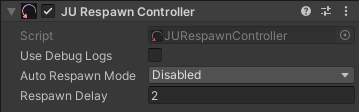

Respawn Controller
==================

Overview
--------

The **JURespawnController** handles player respawn logic after death.  
It can automatically **respawn the player** or **reload the current scene**, depending on the configuration.

Parameters:

- **Auto Respawn Mode**
  
  Defines what happens when the player dies:
  
  - ``RespawnPlayer`` → respawns the player at the start position and rotation
  - ``ReloadScene`` → reloads the current scene
  - ``Disabled`` → disables automatic respawn

- **RespawnDelay**
  
  Time (in seconds) to respawn after player dies.

- **Use Debug Logs**
  
  Enables debug logs in the console.

How To
------

Manually respawn the player:

.. code-block:: csharp

    JURespawnController.RespawnPlayer();

Manually reload the scene:

.. code-block:: csharp

    JURespawnController.ResetLevel();